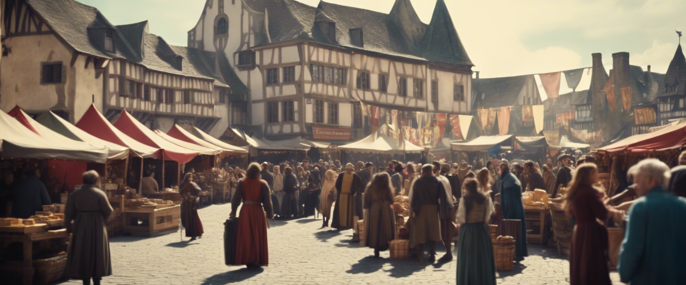
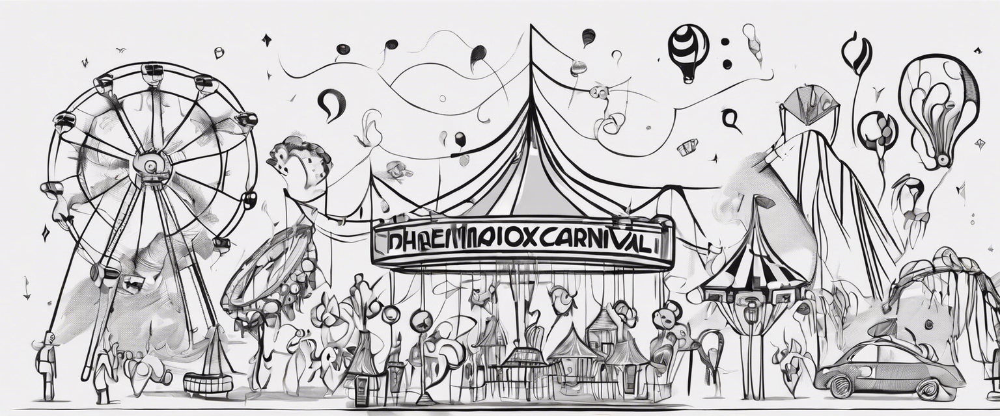

<h1 align="center">First Milestone Project 1 - One Life Community Landing Page</h1>

## User Experience (UX)

-   ### User stories

    -   #### First Time Visitor Goals

        1. As a First Time Visitor, I want to be able to get a feel for the commmunity before joining.
        2. As a First Time Visitor, I want to be able to navigate the website easier so I can find out what the community is about.
        3. As a First Time Visitor, I want to look for testimonials about the community to be able to know if the community is a place that I would like join.
        4. As a First Time Visitor, I want to see if the community has the same interested as myself.
        5. As a First Time Visitor, I want to be able to ask questions that I am unable to find the answers to on the website.

    -   #### Returning Visitor Goals

        1. As a Returning Visitor, I want to see if there are any new hobbies or interesed that would match my own hobbies.
        2. As a Returning Visitor, I want to be able to share some drawings that I have made to get feedback.
        3. As a Returning Visitor, I want to know more about the community and who runs it.

    -   #### Frequent User Goals
        1. As a Frequent User, I want to be able to keep up to date with community events that I would be interested in joining
        2. As a Frequent User, I want to check to see if there are any new community posts that I can give feedback on.
        3. As a Frequent User, I want to be able to share feedback about the community so that first time vistors are able to have an idea of what the community is like.

-   ### Design
    -   #### Colour Scheme
        -   I used [Color Hunt](https://colorhunt.co) to find a colour palette I felt went well with the design of the website. This is the [Colour Palette](https://colorhunt.co/palette/3924675d3587a367b1ffd1e3) that I ended up chosing and these will be featured throughout the website.
    -   #### Typography
        -   The Oswald and Roboto are the two main font used throughout the whole website with Sans Serif as the fallback font in case for any reason these fonts are not being imported into the site correctly. Both fonts are clean and commonly used fonts, Oswald is have more of a block type look to is making it ideal for Headers and Titles while Roboto is more rounded and ideal for website text.
    -   #### Imagery
        -   Imagery is important. The large, background hero image is designed to be striking and catch the user's attention. It also has a modern, energetic aesthetic.
        -   The occupanying imagery to go with each feature is aimed to give the user a quick insite into what the feature is.
        -   On the community page all imagery used is from community members who want to show off their talents.

*   ### Wireframes

    -   Whole Website Wireframe - Wireframes for Mobile, Tablet and Web - [View](https://stephen822206.invisionapp.com/freehand/Milestone-Project-1-Adp7w26oL)

## Features

-   Responsive on all device sizes

## Technologies Used

### Languages Used

-   [HTML5](https://en.wikipedia.org/wiki/HTML5)
-   [CSS3](https://en.wikipedia.org/wiki/Cascading_Style_Sheets)

### Frameworks, Libraries & Programs Used

1. [Bootstrap 5.0.2:](https://getbootstrap.com/docs/5.0/getting-started/introduction/)
    - Bootstrap was used to assist with the responsiveness and styling of the website.
1. [Google Fonts:](https://fonts.google.com/)
    - Google fonts were used to import the 'Titillium Web' font into the style.css file which is used on all pages throughout the project.
1. [Font Awesome:](https://fontawesome.com/)
    - Font Awesome was used on all pages throughout the website to add icons for aesthetic and UX purposes.
1. [jQuery:](https://jquery.com/)
    - jQuery came with Bootstrap to make the navbar responsive but was also used for the smooth scroll function in JavaScript.
1. [Git](https://git-scm.com/)
    - Git was used for version control by utilizing the Gitpod terminal to commit to Git and Push to GitHub.
1. [GitHub:](https://github.com/)
    - GitHub is used to store the projects code after being pushed from Git.
1. [InVision:](https://www.invisionapp.com)
    - InVision was used to create the [wireframes](https://stephen822206.invisionapp.com/freehand/Milestone-Project-1-Adp7w26oL) during the design process.

## Testing

The W3C Markup Validator and W3C CSS Validator Services were used to validate every page of the project to ensure there were no syntax errors in the project.

-   [W3C Markup Validator](https://jigsaw.w3.org/css-validator/#validate_by_input) - [Results](https://github.com/)
-   [W3C CSS Validator](https://jigsaw.w3.org/css-validator/#validate_by_input) - [Results](https://github.com/)

### Testing User Stories from User Experience (UX) Section

-   #### First Time Visitor Goals

-   #### Returning Visitor Goals

-   #### Frequent User Goals

### Further Testing

-   The Website was tested on Google Chrome, Internet Explorer, Microsoft Edge and Safari browsers.
-   The website was viewed on a variety of devices such as Desktop, Laptop, iPhone7, iPhone 8 & iPhoneX.
-   A large amount of testing was done to ensure that all pages were linking correctly.
-   Friends and family members were asked to review the site and documentation to point out any bugs and/or user experience issues.

### Known Bugs

## Deployment

### GitHub Pages

The project was deployed to GitHub Pages using the following steps...

1. Log in to GitHub and locate the [GitHub Repository](https://github.com/)
2. At the top of the Repository (not top of page), locate the "Settings" Button on the menu.
    - Alternatively Click [Here](https://raw.githubusercontent.com/) for a GIF demonstrating the process starting from Step 2.
3. Scroll down the Settings page until you locate the "GitHub Pages" Section.
4. Under "Source", click the dropdown called "None" and select "Master Branch".
5. The page will automatically refresh.
6. Scroll back down through the page to locate the now published site [link](https://github.com) in the "GitHub Pages" section.

### Forking the GitHub Repository

By forking the GitHub Repository we make a copy of the original repository on our GitHub account to view and/or make changes without affecting the original repository by using the following steps...

1. Log in to GitHub and locate the [GitHub Repository](https://github.com/)
2. At the top of the Repository (not top of page) just above the "Settings" Button on the menu, locate the "Fork" Button.
3. You should now have a copy of the original repository in your GitHub account.

### Making a Local Clone

1. Log in to GitHub and locate the [GitHub Repository](https://github.com/)
2. Under the repository name, click "Clone or download".
3. To clone the repository using HTTPS, under "Clone with HTTPS", copy the link.
4. Open Git Bash
5. Change the current working directory to the location where you want the cloned directory to be made.
6. Type `git clone`, and then paste the URL you copied in Step 3.

```
$ git clone https://github.com/YOUR-USERNAME/YOUR-REPOSITORY
```

7. Press Enter. Your local clone will be created.

```
$ git clone https://github.com/YOUR-USERNAME/YOUR-REPOSITORY
> Cloning into `CI-Clone`...
> remote: Counting objects: 10, done.
> remote: Compressing objects: 100% (8/8), done.
> remove: Total 10 (delta 1), reused 10 (delta 1)
> Unpacking objects: 100% (10/10), done.
```

Click [Here](https://help.github.com/en/github/creating-cloning-and-archiving-repositories/cloning-a-repository#cloning-a-repository-to-github-desktop) to retrieve pictures for some of the buttons and more detailed explanations of the above process.

## Credits

### Code

-   [Bootstrap5](https://getbootstrap.com/docs/5.0/getting-started/introduction/): Bootstrap Library used throughout the project mainly to make site responsive using the Bootstrap Grid System.


### Content

-   All content was written by the developer.

### Media

-   All Images were created by the developer using [Dream Studio](https://beta.dreamstudio.ai/generate)

### Acknowledgements

-   My Mentor for continuous helpful feedback.

## Problems and Soultions

### Collapsable Menu on Mobile

One big hurdle I came across was figuring out how to make the navigation bar change to a clickable button which creates a dropdown menu for the navigation only on mobile devices. I knew this was possible using bootstrap but it took a while to figure out how to implement it.

The first step was to figure out how to make the navigation toggle button, which while in the [Bootstrap Documentation](https://getbootstrap.com/docs/5.0/components/navbar/) I used this code which worked as the navigation toggle button:

```
<nav class="navbar navbar-dark bg-dark">
  <div class="container-fluid">
    <button class="navbar-toggler" type="button" data-bs-toggle="collapse" data-bs-target="#navbarToggleExternalContent" aria-controls="navbarToggleExternalContent" aria-expanded="false" aria-label="Toggle navigation">
      <span class="navbar-toggler-icon"></span>
    </button>
  </div>
</nav>

```

Once adding this to the end of my header div I needed to add the **collapse** class and **navbarToggleExternalContent** id to the unordered list holding the navigation links.

The next obsticle was to figure out how to have the navigation toggle button only display on smaller screen, and to make the navigation bar only collapse when on smaller screens. 

For this I knew I would have to implement a media query is style.css to change the display property of the **navbar** to none, but my stuggle come from how to make it so that the navbar didn't collapse when in tablet or web view. I did some research using both the [Bootstrap Documentation](https://getbootstrap.com/docs/5.2/getting-started/introduction/) and this [Stack Overflow Post](https://stackoverflow.com/questions/74548965/bootstrap-5x-collapse-on-mobile-only) I found that I needed to add the following code in my media query to show all collapsed content on a big screen size

```
.collapse:not(.show) {
        display: block;
        visibility: visible;
    }

```

Once I had to functionality working I had to get the dropdown menu into the correct position, and to do this I made the width of **navbar-nav** to 45%, set the display of all the list items within the navbar to block so they now stack, and then moved the whole navbar to the right and gave it a top offset of 70px to sit just below the header div. Here is the code

```
.navbar-nav {
        width: 40%;
        margin: 0;
        padding:0;
        position: absolute;
        right: 0;
        top: 70px;
    }

    .nav-item {
        display: block;
        text-align: center;
        background-color: #A367B1;
        border: 1px solid white;
        line-height: 50%;
        width:100%;
    }
    
```


### Image Carousel

I knew it was going to be possible to add an Image Carousel with Bootstrap 5 after reading through the [Bootstrap Documentation](https://getbootstrap.com/docs/5.2/getting-started/introduction/). I felt this was a nice simple way to showcase different art pieces that have come from the community on the **Our Community Page**. With this in mind I found the following code in the documentation which I used to help build the carousel:

```

<div id="carouselExampleCaptions" class="carousel slide" data-bs-ride="carousel">
  <div class="carousel-indicators">
    <button type="button" data-bs-target="#carouselExampleCaptions" data-bs-slide-to="0" class="active" aria-current="true" aria-label="Slide 1"></button>
    <button type="button" data-bs-target="#carouselExampleCaptions" data-bs-slide-to="1" aria-label="Slide 2"></button>
    <button type="button" data-bs-target="#carouselExampleCaptions" data-bs-slide-to="2" aria-label="Slide 3"></button>
  </div>
  <div class="carousel-inner">
    <div class="carousel-item active">
      
      <div class="carousel-caption d-none d-md-block">
        <h5>First slide label</h5>
        <p>Some representative placeholder content for the first slide.</p>
      </div>
    </div>
    <div class="carousel-item">
      
      <div class="carousel-caption d-none d-md-block">
        <h5>Second slide label</h5>
        <p>Some representative placeholder content for the second slide.</p>
      </div>
    </div>
    <div class="carousel-item">
      
      <div class="carousel-caption d-none d-md-block">
        <h5>Third slide label</h5>
        <p>Some representative placeholder content for the third slide.</p>
      </div>
    </div>
  </div>
  <button class="carousel-control-prev" type="button" data-bs-target="#carouselExampleCaptions" data-bs-slide="prev">
    <span class="carousel-control-prev-icon" aria-hidden="true"></span>
    <span class="visually-hidden">Previous</span>
  </button>
  <button class="carousel-control-next" type="button" data-bs-target="#carouselExampleCaptions" data-bs-slide="next">
    <span class="carousel-control-next-icon" aria-hidden="true"></span>
    <span class="visually-hidden">Next</span>
  </button>
</div>

```

This added everything I wanted from the carousel, the image scrolling function, the Next and Previous arrows, the slide indicator at the bottom and the ability to have a small description with each image to let everyone know who made the art and what the art was about. From the code above I wanted to expand the carousel to have 10 images rather than the 3 by default so for each new image I added an extra section of code, which was: 

```
<div class="carousel-item">
      
      <div class="carousel-caption d-none d-md-block">
        <h5>Third slide label</h5>
        <p>Some representative placeholder content for the third slide.</p>
      </div>
    </div>

```

Once adding the correct amount of sections I was testing the carousel and noticed that once I got past the third image the next and previous arrows no longer responded. I looked over the code and noticed at the top of the code block there was a line of code that controlled the arrows.

```
<button type="button" data-bs-target="#carouselExampleCaptions" data-bs-slide-to="2" aria-label="Slide 3"></button>

```

Once discovering this I added the correct amount of button elements and everything was working correctly with the carousel. My final code the carousel was the follow: 

```
<div id="carouselExampleCaptions" class="carousel slide talent-showcase" data-bs-ride="carousel">
        <div class="carousel-indicators">
          <button type="button" data-bs-target="#carouselExampleCaptions" data-bs-slide-to="0" class="active" aria-current="true" aria-label="Slide 1"></button>
          <button type="button" data-bs-target="#carouselExampleCaptions" data-bs-slide-to="1" aria-label="Slide 2"></button>
          <button type="button" data-bs-target="#carouselExampleCaptions" data-bs-slide-to="2" aria-label="Slide 3"></button>
          <button type="button" data-bs-target="#carouselExampleCaptions" data-bs-slide-to="3" aria-label="Slide 4"></button>
          <button type="button" data-bs-target="#carouselExampleCaptions" data-bs-slide-to="4" aria-label="Slide 5"></button>
          <button type="button" data-bs-target="#carouselExampleCaptions" data-bs-slide-to="5" aria-label="Slide 6"></button>
          <button type="button" data-bs-target="#carouselExampleCaptions" data-bs-slide-to="6" aria-label="Slide 7"></button>
          <button type="button" data-bs-target="#carouselExampleCaptions" data-bs-slide-to="7" aria-label="Slide 8"></button>
          <button type="button" data-bs-target="#carouselExampleCaptions" data-bs-slide-to="8" aria-label="Slide 9"></button>
          <button type="button" data-bs-target="#carouselExampleCaptions" data-bs-slide-to="9" aria-label="Slide 10"></button>
        </div>
        <div class="carousel-inner">
          <div class="carousel-item active">
            
            <div class="carousel-caption d-none d-md-block">
              <h5>First slide label</h5>
              <p>Some representative placeholder content for the first slide.</p>
            </div>
          </div>
          <div class="carousel-item">
            
            <div class="carousel-caption d-none d-md-block">
              <h5>Second slide label</h5>
              <p>Some representative placeholder content for the second slide.</p>
            </div>
          </div>
          <div class="carousel-item">
            
            <div class="carousel-caption d-none d-md-block">
              <h5>Third slide label</h5>
              <p>Some representative placeholder content for the third slide.</p>
            </div>
          </div>
          <div class="carousel-item">
            
            <div class="carousel-caption d-none d-md-block">
              <h5>Forth slide label</h5>
              <p>Some representative placeholder content for the third slide.</p>
            </div>
          </div>
          <div class="carousel-item">
            
            <div class="carousel-caption d-none d-md-block">
              <h5>Fifth slide label</h5>
              <p>Some representative placeholder content for the third slide.</p>
            </div>
          </div>
          <div class="carousel-item">
            
            <div class="carousel-caption d-none d-md-block">
              <h5>Sixth slide label</h5>
              <p>Some representative placeholder content for the third slide.</p>
            </div>
          </div>
          <div class="carousel-item">
            
            <div class="carousel-caption d-none d-md-block">
              <h5>Seventh slide label</h5>
              <p>Some representative placeholder content for the third slide.</p>
            </div>
          </div>
          <div class="carousel-item">
            
            <div class="carousel-caption d-none d-md-block">
              <h5>Eigth slide label</h5>
              <p>Some representative placeholder content for the third slide.</p>
            </div>
          </div>
          <div class="carousel-item">
            
            <div class="carousel-caption d-none d-md-block">
              <h5>Ninth slide label</h5>
              <p>Some representative placeholder content for the third slide.</p>
            </div>
          </div>
          <div class="carousel-item">
            
            <div class="carousel-caption d-none d-md-block">
              <h5>Tenth slide label</h5>
              <p>Some representative placeholder content for the third slide.</p>
            </div>
          </div>
        </div>
        <button class="carousel-control-prev" type="button" data-bs-target="#carouselExampleCaptions" data-bs-slide="prev">
          <span class="carousel-control-prev-icon" aria-hidden="true"></span>
          <span class="visually-hidden">Previous</span>
        </button>
        <button class="carousel-control-next" type="button" data-bs-target="#carouselExampleCaptions" data-bs-slide="next">
          <span class="carousel-control-next-icon" aria-hidden="true"></span>
          <span class="visually-hidden">Next</span>
        </button>
      </div>

```